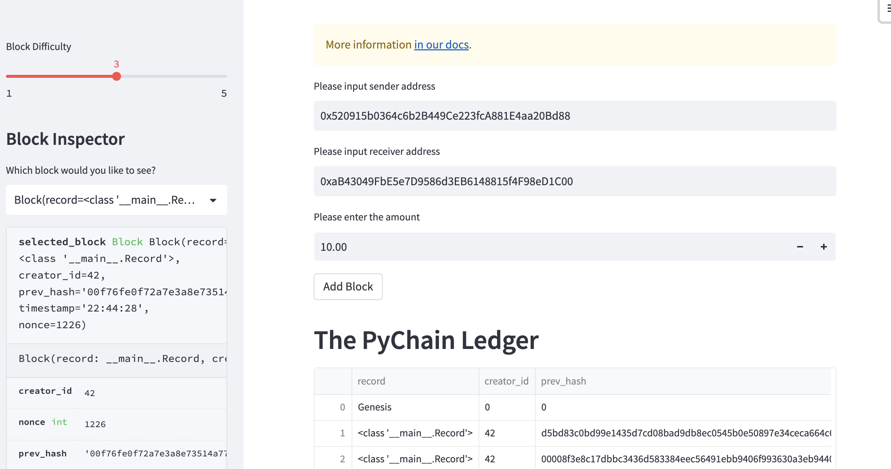
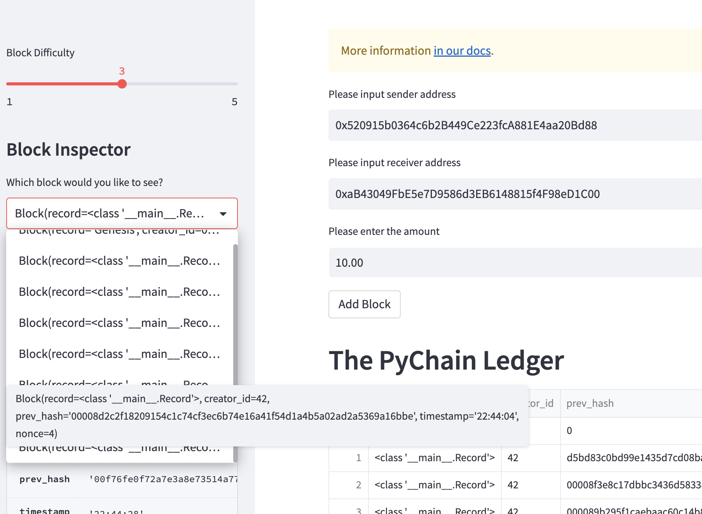
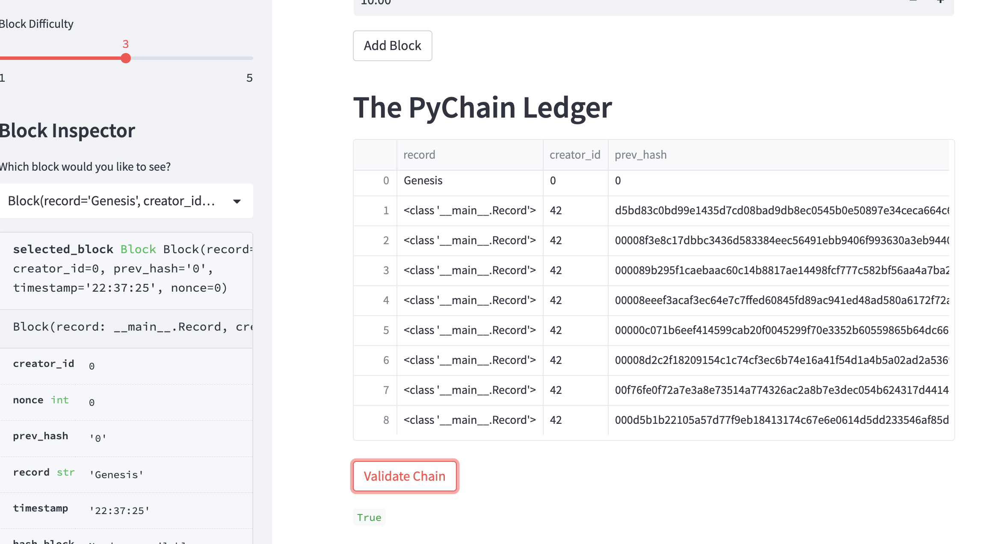
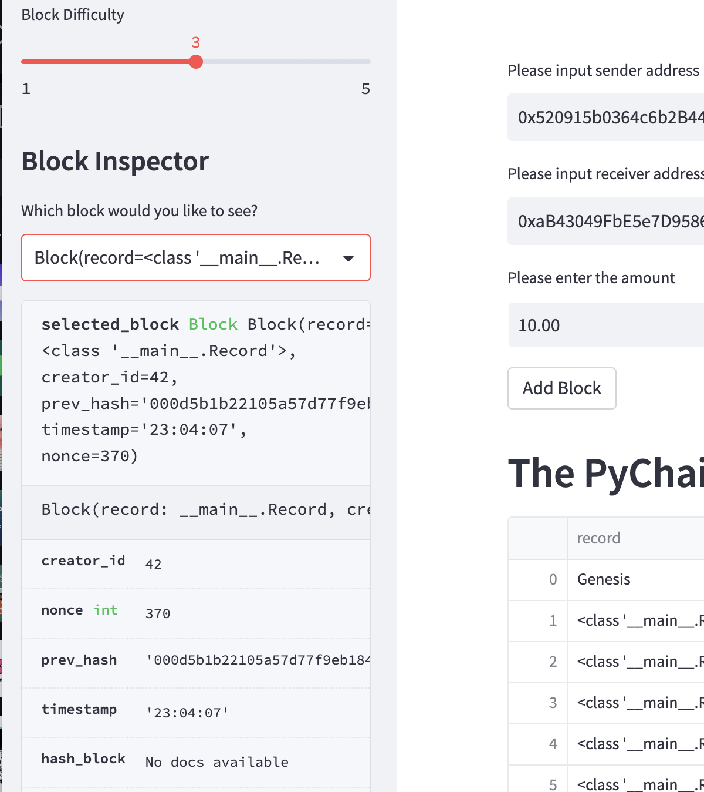

# BlockChain Ledger Development

In this task, we've built a blockchain-based ledger system, complete with a user-friendly web interface. This ledger allows partner banks to conduct financial transactions and verifies the integrity of the data in the ledger. 

This program was developed and presented in streamlit.

## Screenshots

Here are some screenshots of our program in action:

**a. Creating and Storing Multiple Unique Blocks**

When valid variables are entered in the sender, receiver, and amount inputs, the system was able to create and store multiple unique blocks to the ledger.

**b. Blocks and Hashes Verification**

The blocks and hashes are verified with multiple blocks, in the drop down menu.

**c. Validation Process**

The validation process is also passed as verified by the validate button below.

**d. Chaining Blocks**

Each block is chained correctly with the previous hash and the difficulty is verified.

We've successfully created a blockchain ledger for our internal team, and it is ready to be developed for our next stage.

## Licenses

This project uses the following open-source packages:

- [Streamlit](https://streamlit.io/): Streamlit is an open-source app framework for Machine Learning and Data Science teams. View the Streamlit [license](https://github.com/streamlit/streamlit/blob/develop/LICENSE).

- [Pandas](https://pandas.pydata.org/): Pandas is an open source data analysis and manipulation tool, built on top of the Python programming language. View the Pandas [license](https://github.com/pandas-dev/pandas/blob/master/LICENSE).

- [Hashlib](https://docs.python.org/3/library/hashlib.html): Hashlib is a Python library used to securely hash messages. It is included as part of Python's Standard Library, so its use is governed by Python's [license](https://docs.python.org/3/license.html).